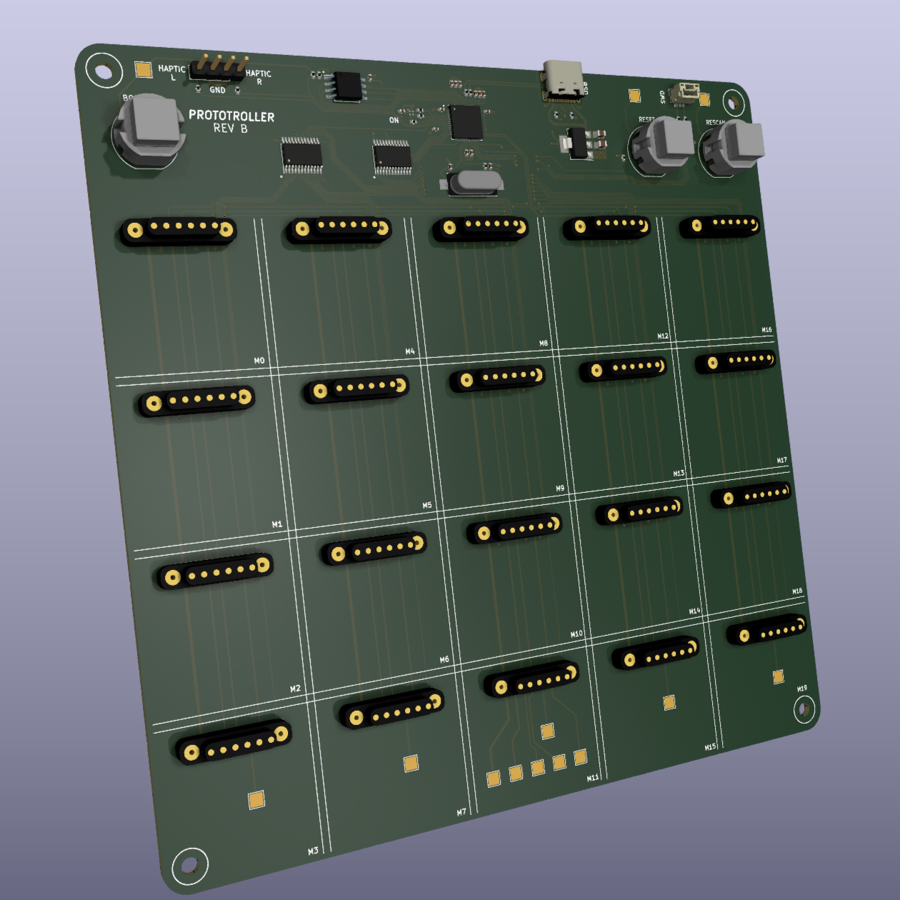

<p align="center">
  
</p>

## About
Modular controllers are few and far between, especially in the open-source community. We aim to change this by creating a full-stack, feature-rich, usable, responsive, and robust modular controller. The device could be used for any HID-compliant purpose, but we focus on developing swappable modules that can form customizable gamepads.

A potential use-case is QoL hardware-level remapping for the benefit of the general user.

Another could be rapidly prototyping different controller layouts for games or simulations in development.

In any case, we dub thy the __Prototroller__. Our team consists of 5 members:
- Yu-yang Hsieh
- Britton McLeavy
- Caleb O'Malley
- Merrick Ryman
- Evan Zhang

This project is developed in conjunction with the UF CpE Capstone program (Fall 2022 - Spring 2023). This project is self-funded. As such, donations are appreciated in this educational pursuit (hardware is not cheap nowadays).

## Hardware Architecture and Aesthetics
At the highest abstraction our hardware consists of the following:
- Master Board 
- Module Boards
- Component Interfaces
- Enclosures

### Master Board

<p>



The master board is the - you guessed it - brains of the operation. It handles the data store of connected modules, transfers and receives data with modules over SPI, transfers and receives HID data over USB with the host, rescans modules, has buttons for various functions, etc. Most of the master board also serves as the <i>protogrid</i>, that is, the 4x5 grid of module slots the user can snap modules to.
<br><br>
At a high level, data flows like this: Host <== USB ==> Master Board <== SPI ==> Module Board <== X ==> Component Interfaces.

<br clear="left"/>
</p>

The master board has buttons for rescanning, resetting, and flashing. There are header pins for interfacing with haptic feedback motors. A 3-pin JST-SH header (1.00mm) is available for serial wire debug. Finally, there is a USB-C receptacle (2.0) for power and data connection with the host.

The connection interface between the <i>protogrid</i> and modules uses 6-pin magnetic pogo-pin connector pairs. These carry VCC, GND, and SPI signals from the master board to the module board(s), maintaining a solid physical connection. It is important to note the master board feeds modules with 3.3V from its own LDO regulator.

### Module Boards

<p>


The module boards are generic and constrained at 30x30mm with no direct user interface, save for the magnetic connector and serial wire debug headers. On the sides are pin headers, giving 14 signals to a component interface board (the "board" sitting atop the module board containing the component itself). This way there are no unique module boards for each component, and we simply offload the task to the component interface board by hand.
<br clear="right"/>
</p>

### Component Interface Boards

<p>


The component interface boards are veroboards with hand-routed component(s). These sit atop the module board headers. We may freely route signals from the module board around. The module interface then looks like this: Protogrid <== MAG. CONNECTOR ==> Module Board <== HEADERS ==> Component Interface Board <== SOLDERED COMPONENTS ==> User I/O.
<br clear="left"/>
</p>

### Enclosures

This would not be a very comfortable controller to use without enclosures.

The master board is enclosed by a chassis and grips.

The module enclosures contain the module board and component interface boards, but do not cover the component.

<p align="center">
  
</p>

## Usage
There are a few ways you may use the Prototroller.
### _Our Hardware, Our Software_
Recommended. This combines our hardware (listed above) with the software to do the job.
The end result is a full-stack (HW+SW) modular controller that implements our goals and, as such, is supported.
Our recommended PCB supplier is JLCPCB, and we are working on formalizing our recommendations for ordering.

We cannot provide any hardware support, sorry; only software in this case.

### _Your Hardware, Our Software_
If you want to develop your own hardware to use with our software, that is excellent! In fact, we are curious to see your designs.

You may even use our designs as a starting point. For example, you may want to make the modules slightly larger.

In any case, we cannot promise any help if you do this. An attempt may be made, but we have busy lives too.

## Building and Flashing Master Boards
The master board has a USB-C receptacle which may be used mount and flash RP2040 binaries (.UF2), accessible by holding down BOOTSEL and performing a reset. The process to generate the binary is as so:
1. Ensure the pico-sdk is installed alongside the TLD.
2. Make and cd into a build directory, and export the Pico SDK path:
    ```
    $ cd prototroller
    $ mkdir build
    $ cd build
    $ export PICO_SDK_PATH=...
    ```
3. Generate the build files with flag -DPICO_BOARD=prototroller:
    ```
    $ cmake -DPICO_BOARD=prototroller ..
    ```
4. Build all targets by running `make`. To build only host, master, or module targets, cd into the respective directory (generated by the cmake command above) and execute `make`. In this case, you can just `cd` into master and execute `make`.
5. This will generate the appropriate `.uf2` binaries, which can be flashed by dragging onto the mount.

## Building and Flashing Module Boards
The module boards clearly do not have a USB-C receptacle, so the process to flash is a bit more involved. You must use the available SWD pins in conjunction with a programmer: we recommend the Raspberry Pi Pico flashed with the Picoprobe firmware.

This process is only an example of how you could flash using SWD after setting up Picoprobe, OpenOCD, etc:
1. Follow the steps listed in "Building and Flashing Master Boards" to generate the firmware for the module boards.
2. Connect SWDIO and SWCLK from Picoprobe to the SWD headers above the flash on the module board (labeled on rear silkscreen).
3. Connect a *common ground* between the Picoprobe and the module board.
4. Snap the module board to a powered master board (alternatively, supply 3V3 through the female header).
5. If you are using WSL, pass-through the Picoprobe in Powershell using usbipd.
6. Execute the following command to flash firmware, where `joystick-module.elf` is the name of the ELF executable generated previously:
    ```
    sudo openocd -f interface/cmsis-dap.cfg -f target/rp2040.cfg -c "adapter speed 5000" -c "program build/module/joystick-module.elf verify reset exit"
    ```
If all went well, the module board should be flashed. You can safely remove the SWD wires and set the Picoprobe aside.

Here is an excellent tutorial to setting up and using Picoprobe: https://github.com/robotdad/piconotes

## Roadmap
- [x] Proof of Concept Build
- [x] Basic Master/Module Firmware
- [x] Basic Host HID Drivers
- [x] Basic Component Support
- [x] Prototype Build
- [x] Interconnect Design
- [x] Module Board Design(s)
- [x] Master Board Design
- [x] Chassis/Module Enclosure Designs (Mar. 01, 2023)
- [ ] Advanced Firmware (Mar. 01, 2023)
- [ ] Advanced HID Drivers (Mar. 01, 2023)
- [ ] Advanced Component Support (Mar. 01, 2023)
- [ ] Finalized Firmware (April 01, 2023)
- [ ] Prototroller Artifact (April 01, 2023)

## Acknowledgements
Thank you to our stakeholder Carsten Thue-Bludworth for his infinite wisdom. His assistance keeps the project grounded and evolving in the best way possible.

Thank you to Dr. Blanchard and the UF CpE Capstone program for direction and usage of lab space.

Thank you to the Raspberry Pi community for the hardware and software that made this project possible.

Thank you to Phil's Lab on YouTube for the excellent courses and tutorials on hardware design.

Thank you to user testing participants for valuable feedback. Their insights and suggestions have helped us refine our design and ensure that our final product meets the needs and expectations of its intended users.

Thank you to families, friends, and loved ones for their unwavering support and encouragement. Their belief in our abilities and commitment to our success has been a constant source of motivation and inspiration.
