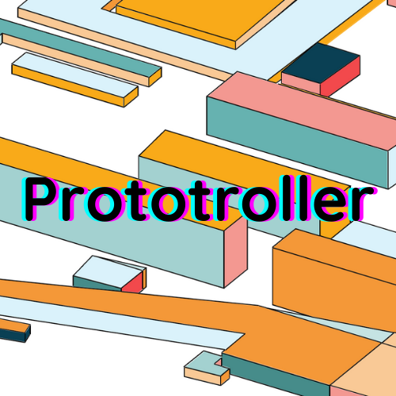
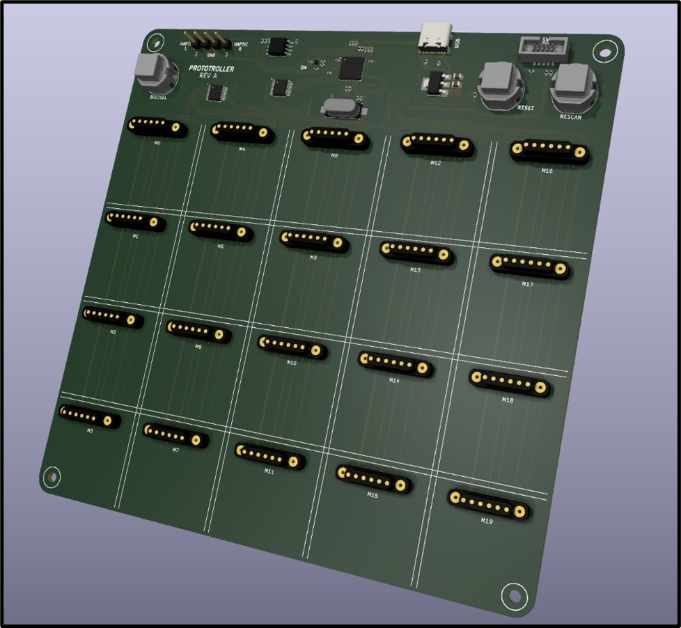
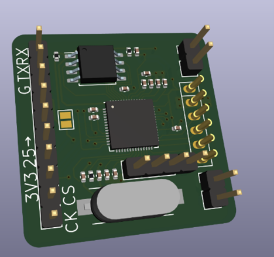
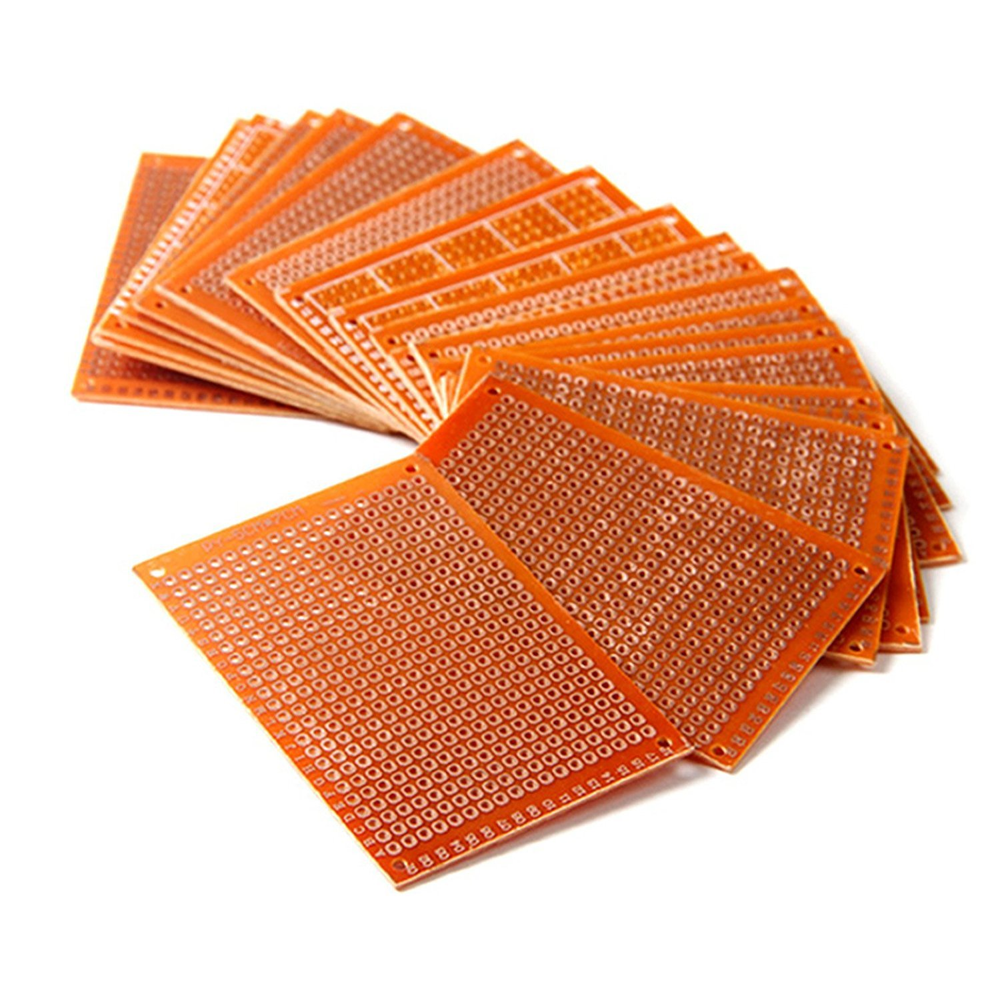
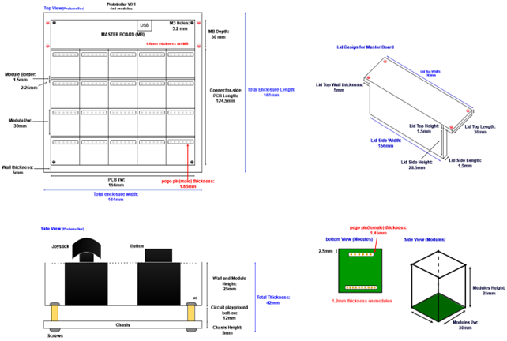

<p align="center">
  
</p>

## About
Modular controllers are few and far between, especially in the open-source community. We aim to change this by creating a full-stack, feature-rich, usable, responsive, and robust modular controller. The device could be used for any HID-compliant purpose, but we focus on developing swappable modules that can form customizable gamepads.

A potential use-case is QoL hardware-level remapping for the benefit of the general user.

Another could be rapidly prototyping different controller layouts for games or simulations in development.

In any case, we dub thy the __Prototroller__. Our team consists of 5 members:
- Yu-yang Hsieh
- Britton McLeavy
- Caleb O'Malley
- Merrick Ryman
- Evan Zhang

This project is developed in conjunction with the UF CpE Capstone program (Fall 2022 - Spring 2023). This project is self-funded. As such, donations are appreciated in this educational pursuit (hardware is not cheap nowadays!).

## Hardware Architecture and Aesthetics
At the highest abstraction our hardware consists of the following:
- Master Board 
- Module Boards
- Component Interfaces
- Enclosures

### Master Board

<p>



The master board is the - you guessed it - brains of the operation. It handles the data store of connected modules, transfers and receives data with modules over SPI, transfers and receives HID data over USB with the host, rescans modules, has headers for haptic feedback, has buttons for various functions, etc. Most of the master board also serves as the <i>protogrid</i>, that is, the 4x5 grid of module slots the user can snap modules to.
<br><br>
At a high level, controller data flows like this: Host < == USB == > MASTER BOARD < == SPI == > MODULE BOARDS.

<br clear="left"/>
</p>

Direct interfaces on the master board include buttons for rescanning, resetting, and flashing. There are header pins for interfacing with haptic feedback motors (i.e., controller vibrations). An SWD header (1.27mm) is available for debugging. Most importantly, there is a USB-C receptacle for power and data connection with the host.

Connections between the <i>protogrid</i> and modules are magnetic through the use of 6-pin magnetic pogo pin connectors. These carry VCC, GND, and the SPI signals from the master board to the module board, while maintaining a solid physical connection. It is important to note the master feeds modules with 3.3V from its own LDO regulator.

### Module Boards

<p>



The module boards are generic, no matter the component (more on that later). They are constrained at 30x30mm. These have no direct interface with the user, save for the magnetic connector and SWD headers for debugging and flashing. On the sides are pin headers, giving 10 signals to a component interface board, i.e., the "board" sitting atop the module board containing the component itself. In this way, we do not have to design a unique module board for each component, and simply offload the task to hand-making the component interface board.
<br clear="right"/>
</p>

### Component Interface Boards

<p>



The component interface boards are simply veroboards with soldered component(s). These veroboard sits atop the module board headers. We don't use "standard" veroboard, that is, long strips of copper. Instead, we opted for a kind with a copper pad per through-hole. This way, we can freely route our signals from the module board around the veroboard. Take a joystick for example. The design would look like this: PROTOGRID < == MAG. CONNECTOR == > MODULE BOARD < == HEADERS == > COMPONENT INTERFACE BOARD < == SOLDERED COMPONENTS ==> USER I/O.
<br clear="left"/>
</p>

### Enclosures

Of course, this would not be a very comfortable controller to use without enclosures.

The master board is enclosed by a chassis, with optional grips. It has a lid to hide the non-protogrid portion and also contains the haptic feedback motors.

The module enclosures contain the module board and component interface boards, but do not cover the component.

<p align="center">
  
</p>

## Usage
There are a few ways you may use the Prototroller.
### _Our Hardware, Our Software_
Recommended. This combines our hardware (listed above) with the software to do the job.
The end result is a full-stack (HW+SW) modular controller that implements our goals and, as such, is supported.
Our recommended PCB supplier is JLCPCB, and we are working on formalizing our recommendations for ordering.

We cannot provide any hardware support, sorry; only software in this case.

### _Your Hardware, Our Software_
If you want to develop your own hardware to use with our software, that is excellent! In fact, we are curious to see your designs.

You may even use our designs as a starting point. For example, you may want to make the modules slightly larger.

In any case, we cannot promise any help if you do this. An attempt may be made, but we have busy lives too.

## Building
1. Ensure the pico-sdk is installed alongside the TLD.
2. Make and cd into a build directory, and export the Pico SDK path:
    ```
    $ cd prototroller
    $ mkdir build
    $ cd build
    $ export PICO_SDK_PATH=...
    ```
3. Generate the build files. For boards other than the Pico, use the -DPICO_BOARD=... flag. We do not guarantee functionality on boards other than the Pico at this time, due to different pinouts.
    ```
    $ cmake ..
    ```
4. Build all targets by running `make`. To build only host, master, or module targets, cd into the respective directory and run `make`.
5. This will generate `.uf2` files for the master Pico board and each module, which can be flashed onto the Pico boards.

## Roadmap
- [x] Proof of Concept Build
- [x] Basic Master/Module Firmware
- [x] Basic Host HID Drivers
- [x] Basic Component Support
- [x] Prototype Build
- [x] Interconnect Design
- [x] Module Board Design(s)
- [x] Master Board Design
- [ ] Chassis/Module Enclosure Designs (Mar. 01, 2023)
- [ ] Advanced Firmware (Mar. 01, 2023)
- [ ] Advanced HID Drivers (Mar. 01, 2023)
- [ ] Advanced Component Support (Mar. 01, 2023)
- [ ] Finalized Firmware (April 01, 2023)
- [ ] Prototroller Artifact (April 01, 2023)

## Acknowledgements
Thank you to our stakeholder Carsten Thue-Bludworth for his infinite wisdom. His assistance keeps the project grounded and evolving in the best way possible.

Thank you to Dr. Blanchard and the UF CpE Capstone program for direction and usage of lab space.

Thank you to the Raspberry Pi community for the hardware and software that made this project possible.

Thank you to Phil's Lab on YouTube for the excellent courses and tutorials on hardware design.

Thank you to user testing participants for valuable feedback. Their insights and suggestions have helped us refine our design and ensure that our final product meets the needs and expectations of its intended users.

Thank you to families, friends, and loved ones for their unwavering support and encouragement. Their belief in our abilities and commitment to our success has been a constant source of motivation and inspiration.
