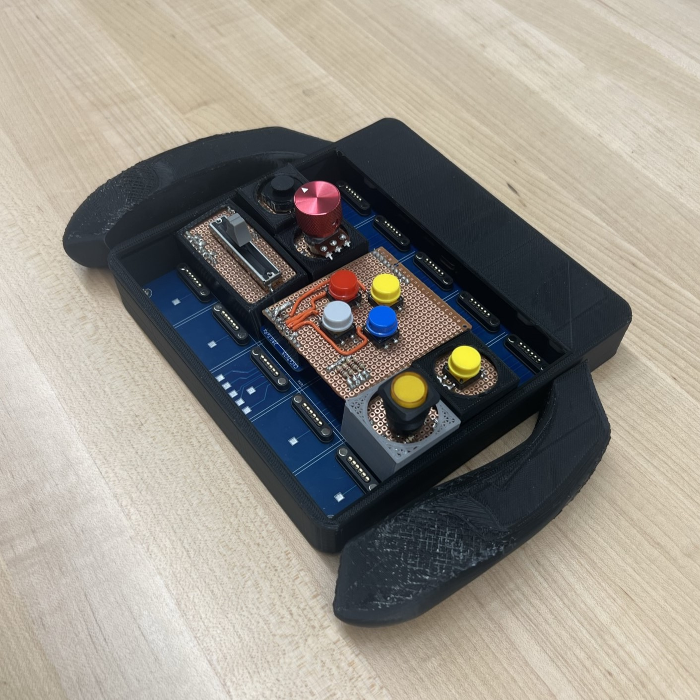
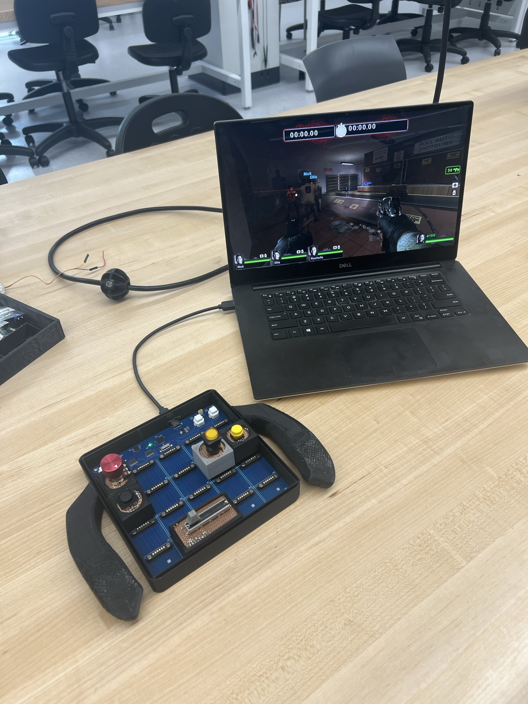
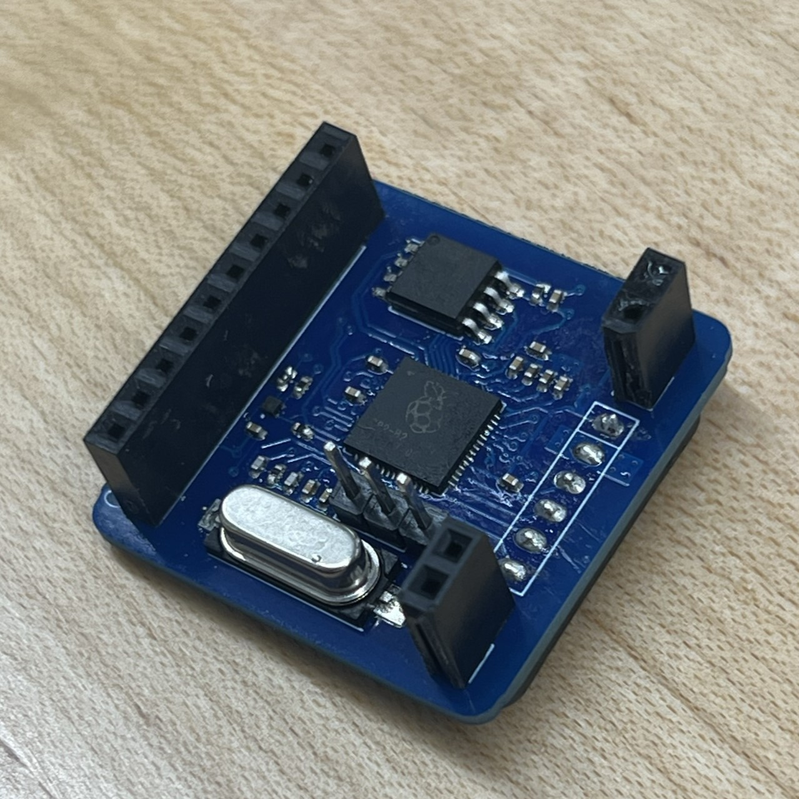
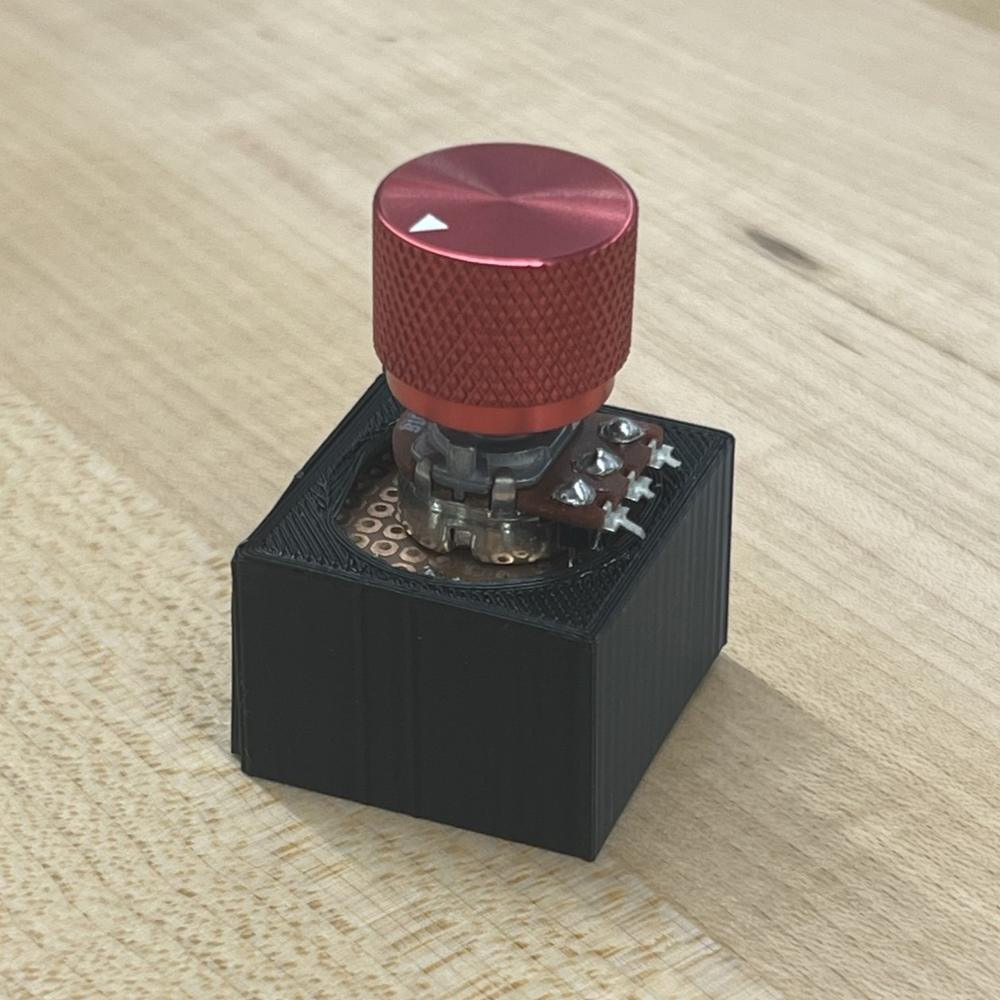
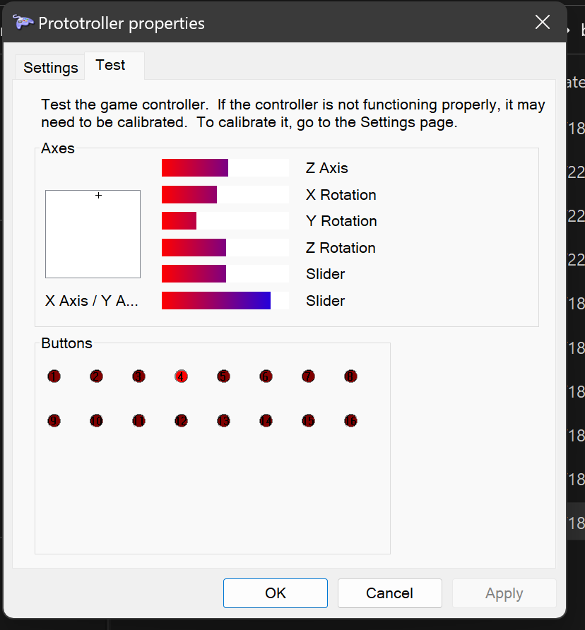
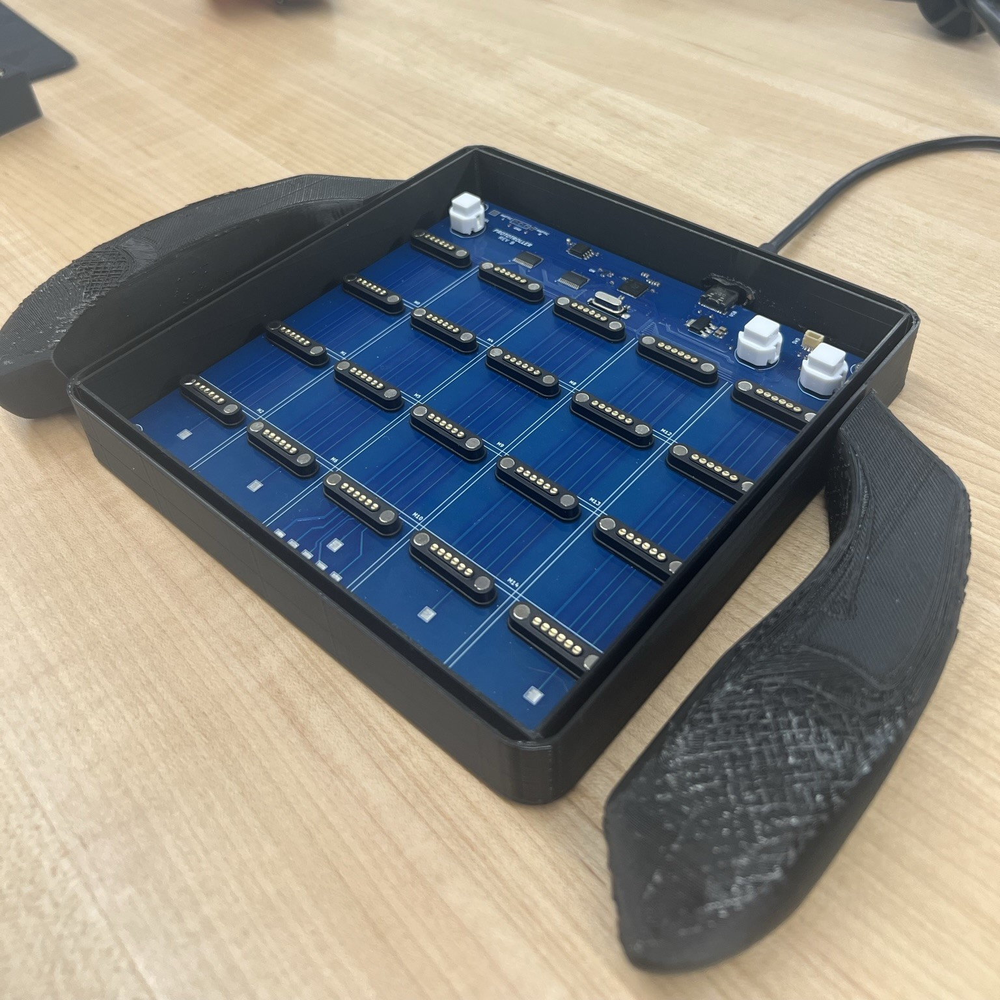

<p align="center">
  
  
</p>

## About
The Prototroller is a ***modular*** controller that is full-stack, feature-rich, responsive, and robust. The controller could be used for any HID-compliant purpose, but we focus on developing hot-swappable modules that can form customizable gamepads.

A potential use case is general hardware level remapping for quality of life. Another is rapidly prototyping different controller layouts for games or simulations in development.

Our team consists of 5 members:
- Yu-yang Hsieh
- Britton McLeavy
- Caleb O'Malley
- Merrick Ryman
- Evan Zhang

This project is developed in conjunction with the UF CpE Capstone program (Fall 2022 - Spring 2023). This project is self-funded. As such, donations are appreciated in this educational pursuit (hardware is not cheap nowadays).

<p align="center">
  
</p>

## Architecture and Aesthetics
At the highest abstraction the Prototroller consists of the following:
- Master Board 
- Module Boards
- Component Interfaces
- Enclosures
- Firmware

### Master Board

<p>


The master board handles the data store of connected modules, transfers and receives data with modules over SPI, transfers and receives HID data over USB with the host, rescans modules, has buttons for various functions, etc. Most of the master board also serves as the the 4x5 grid of module slots the user can snap modules to using magnetic pogo-pin connectors.

<br clear="left"/>
</p>

The master board has buttons for rescanning, resetting, and flashing. There are header pins for interfacing with haptic feedback motors. A 3-pin JST-SH header (1.00mm) is available for serial wire debug. There is a USB-C receptacle (2.0) for power and data connection with the host.

The connection interface between the master board and module boards uses 6-pin magnetic pogo-pin connectors. These carry VCC, GND, and SPI signals, while maintaining a solid physical connection. The master board feeds modules with 3.3V.

### Module Boards

<p>



Module boards are generic and constrained at 30x30mm with no direct user interface (except for the connector and SWD headers). On the sides are headers providing 14 signals to a component interface board that would sit above. This way there are no unique module boards for each component, and we simply offload the task to the component interface board by hand.
<br clear="right"/>
</p>

### Component Interface Boards

<p>


The component interface boards are veroboards sitting above the module board headers. We may freely route signals from the module board to a component, the direct user interface.
<br clear="left"/>
</p>

### Enclosures

This would not be a very comfortable controller to use without enclosures.

The master board is enclosed by a chassis and grips. The master board is screwed to the chassis.

The module enclosures contain the module board and component interface boards, but do not cover the component.

<p align="center">
  
</p>

### Firmware

Each type of module has its own assosciated firmware that can be flashed via the SWD header pins with picoprobe firmware. The master board can be flashed via the normal way of "dragging" the binaries. See below for more details on flashing. The Prototroller has been extensively tested on Windows systems, but will likely work on Mac, Linux, and generally any OS that supports HID gamepads.

<p align="center">
  
</p>


## Usage
There are a few ways you may use the Prototroller.
### _Our Hardware, Our Software_
Recommended. This combines our hardware listed above with the firmware to do the job.
The end result is a full-stack modular controller.

Our recommended PCB supplier is JLCPCB, and we are working on formalizing our recommendations for ordering.

### _Your Hardware, Our Software_
If you want to develop your own hardware to use with our software, that is excellent! In fact, we are curious to see your designs.

You may use our designs as a starting point. For example, you may want to make the modules slightly larger.

## Building and Flashing Master Boards
You may use the provided VSCode launch debug configuration and flash task. This requires a Picoprobe, OpenOCD, and Cortex Debug. Instructions are available in ```/ide```.
An easier way is to use the USB receptacle to mount and flash RP2040 binaries (.uf2), accessible by holding down BOOTSEL and performing a reset. **If you are using VSCode, you can simply edit settings.json for your SDK path, build the target, and proceed to step 5**. Otherwise, the process to generate the binary is as so:
1. Ensure you have the Pico SDK cloned somewhere, such as ```~/pico-sdk```.
2. Make and cd into a 'build' subdirectory, and export the Pico SDK path:
    ```
    $ cd prototroller
    $ mkdir build
    $ cd build
    $ export PICO_SDK_PATH=...
    ```
3. Generate the build targets:
    ```
    $ cmake -DPICO_BOARD=prototroller ..
    ```
4. Build all targets by running `make`. To build only host, master, or module targets, cd into the respective directory (generated by the cmake command above) and execute `make`. In this case, you can just `cd` into master and execute `make`.
5. This will generate the appropriate `.uf2` binaries, which can be flashed by dragging onto the mount.

## Building and Flashing Module Boards
The module boards do not have a USB receptacle. You must use SWD in conjunction with a debug probe. We recommend the official Raspberry Pi Debug Probe ($12), or a Pico flashed with the Picoprobe firmware.

Instructions are available in ```/ide```. This is how you might do it after setting up Picoprobe, OpenOCD, etc:
1. Follow the steps listed in "Building and Flashing Master Boards" to generate the binary for the module boards.
2. Connect SWDIO and SWCLK from debug probe to the SWD headers above the flash on the module board (labeled on rear silkscreen).
3. Connect a *common ground* between the Picoprobe and the module board.
4. Snap the module board to a powered master board (alternatively, supply 3V3 through the female header).
5. If you are using WSL, pass-through the Picoprobe in Powershell using ```usbipd```.
6. Use the '```Prototroller Flash```' task in VSCode, or execute the following command, where `joystick-module.elf` is the name of the ELF executable generated previously:
    ```
    sudo openocd -f interface/cmsis-dap.cfg -f target/rp2040.cfg -c "adapter speed 5000" -c "program build/module/joystick-module.elf verify reset exit"
    ```
If all went well, the module board should be flashed. You can safely remove the SWD wires and set the debug probe aside.

Documentation for the official Raspberry Pi Debug Probe:
https://www.raspberrypi.com/documentation/microcontrollers/debug-probe.html

Alternatively, here is an excellent tutorial to setting up and using Picoprobe if you have a Pico available: https://github.com/robotdad/piconotes

## Roadmap
- [x] Proof of Concept Build
- [x] Basic Master/Module Firmware
- [x] Basic Host HID Drivers
- [x] Basic Component Support
- [x] Prototype Build
- [x] Interconnect Design
- [x] Module Board Design(s)
- [x] Master Board Design
- [x] Chassis/Module Enclosure Designs
- [x] Advanced Firmware
- [x] Advanced HID Drivers
- [x] Advanced Component Support
- [x] Finalized Firmware
- [x] Prototroller Artifact
- [ ] Stretch: Wireless Support
- [ ] Stretch: Power Optimization
- [ ] Stretch: More types of modules

Ideas for future modules: Trigger, D-Pad, Accelerometer, Gyroscope, Rounded Buttons. Could also do some cool things non-gaming related, such as an IR blaster and Bluetooth TX/RX modules.
Adding new types of modules only requires the firmware and custom backpack.

## Acknowledgements
Thank you to our stakeholder Carsten Thue-Bludworth for his infinite wisdom. His assistance keeps the project grounded and evolving in the best way possible.

Thank you to Dr. Blanchard and the UF CpE Capstone program for direction and usage of lab space.

Thank you to the Raspberry Pi community for the hardware and software that made this project possible.

Thank you to Phil's Lab on YouTube for the excellent courses and tutorials on hardware design.

Thank you to user testing participants for valuable feedback. Their insights and suggestions have helped us refine our design and ensure that our final product meets the needs and expectations of its intended users.

Thank you to families, friends, and loved ones for their unwavering support and encouragement. Their belief in our abilities and commitment to our success has been a constant source of motivation and inspiration.

<p align="center">
  
</p>